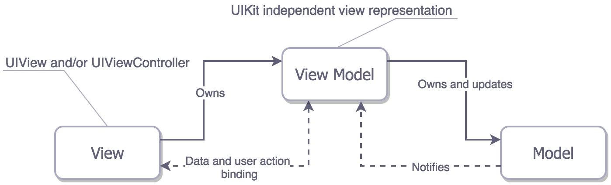

# MVVM Movie App

For  login, use username `velometricg` and password `Aaaaaa1!`.**

This example uses RxSwift observables as binding mechanism between `ViewModel` and `ViewController`. Also, it uses simple navigator for transitions between screns.

|  |
| --- | --- |

## MVVM
||

## Installation
Clone the repository:

`git clone git@github.com:rafsanahmad/iOS-mvvm-Movie-App.git`

Install dependencies:

 `pod install`
